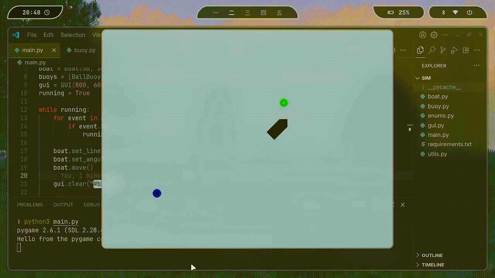

### Setup
Make sure you have a good text editor (or IDE) such as VSCode to work on this project. Seeing the whole picture of the file structure will help you tremendously. Then, [install Python from this website](https://www.python.org/downloads/). Be sure to click the `Add Python <VERSION> to PATH` option so you can run the `python` command.

> [!TIP]
> If you are on Linux, the `python` command won't work due to some interesting reasons you don't have to worry about. Use the `python3` command instead.

Virtual environments such as Conda are a nice tool to encapsulate Python projects with their own dependencies. If you have no idea what any of that means, please don't worry. If you have time [it may be a good idea to look into it though](https://docs.conda.io/projects/conda/en/stable/user-guide/getting-started.html).

Next, copy the folder over to your system by clicking the green button that says "Code," and clicking "Install as ZIP." **If you have managed to install [Git](https://git-scm.com/downloads) and [GitHub CLI](https://cli.github.com/) (`gh`) on your system,** run the following (please see the notes next to each command):
```bash
gh auth login # Authenticate your GitHub account so you can access our organization, use the HTTPS option
git config --global user.name "YOUR-GITHUB-USERNAME"
git config --global user.email "YOUR-GITHUB-EMAIL@EMAIL.COM"
git clone https://github.com/mhseals/mhseals_learn` 
```
Finally, open up the folder in your terminal by running `cd <PATH-TO-FOLDER>`. You should also open the `sim` folder with `cd sim` after you have installed dependencies as described below.

Before you are able to properly run the code, you must install all of the needed dependencies. Think of dependencies as little toolkits that contain useful funtions so we don't have to write all of the complex code ourselves. If you are still unsure of what this means, feel free to use the vast beautiful resource known as the internet to help yourself out. **To install dependencies, run the following command:**
```bash
pip install -r requirements.txt
```

Now you are ready to run the code! Again, make sure you are in the `sim` folder once you have installed the dependencies. You can now run
```bash
python3 main.py # python, not python3 if you are on Windows
```

### Your Task
Now that you are ready to run and test the code, read through all the errors you get after running the code, and fix them one by one until you are able to replicate the example below. [Pylance](https://marketplace.visualstudio.com/items?itemName=ms-python.vscode-pylance) is a very useful tool that can help highlight syntax errors and make your life a lot easier. If you manage to fix the errors easily, have fun! Mess around with the code any maybe try to impress us. Try implementing some cool navigation algorithm like [Dijkstra's](https://www.w3schools.com/dsa/dsa_algo_graphs_dijkstra.php), [PID](https://www.geeksforgeeks.org/electronics-engineering/proportional-integral-derivative-controller-in-control-system/) (there are good videos online and some example code in this repo at `lessons/pid/sim_pid.py`), or [pure pursuit](https://wiki.purduesigbots.com/software/control-algorithms/basic-pure-pursuit).



> [!NOTE]
> If you are practicing fixing the code, please refrain from viewing this; however, the functioning program with no bugs (yes, bugs have intentionally been planted for learning purposes) can be seen at this [commit](https://github.com/MHSeals/mhseals_learn/commit/1aba0507258cc78d8ecb228b64bcb288256499e5).